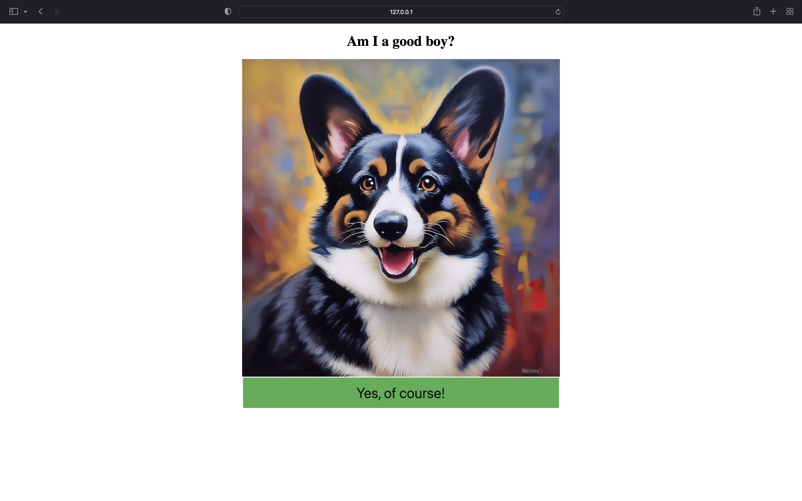
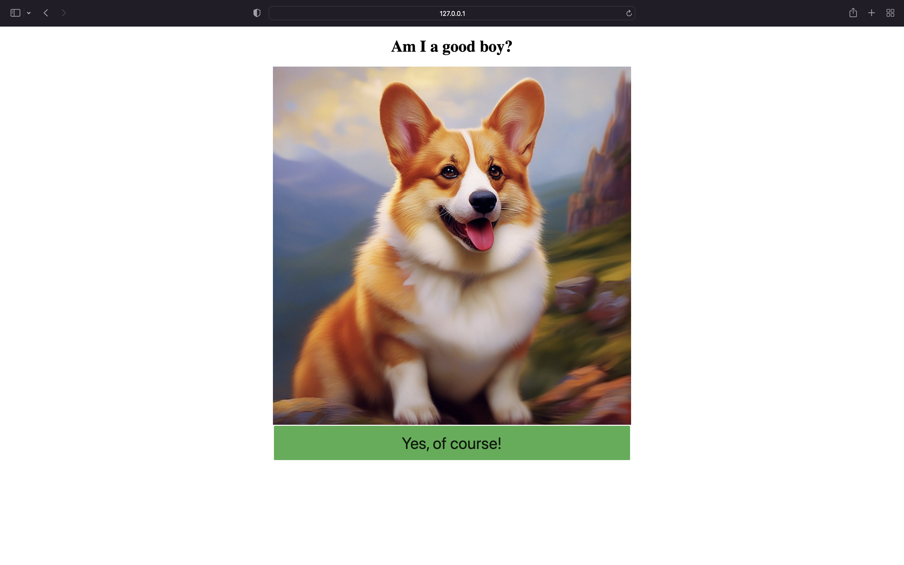

[Русский](#подключение-varioqub-к-вашему-сервису) | [English](#setup-varioqub-for-your-website)

# Подключение Varioqub к вашему сервису

Здесь собраны примеры использования всех доступных методов для подключения А/Б экспериментов через *Varioqub* на ваш сайт.

Существует 4 способов это сделать:
- Визуальный редактор (папка с реализацией [тут](editor/))
- Редирект страницы (папка с реализацией [тут](redirect_frontend))
- Обработка флагов на фронтенде с JS (папка с реализацией [тут](flags_frontend/))
- Обработка флагов на стороне сервера (папка с реализацией [тут](flags_backend/))

Также возможно реализовать редирект с помощью флагов:
- Редирект c помощью флагов (папка с реализацией [тут](redirect_backend/))

Во всех папках реализован один и тот же проект с одинаковым экспериментом. Для реализации серверной части используется библиотека `flask`.

## Реклама

Если для рекламы вы используете Рекламную Сеть Яндекса и Adfox, то есть возможность проводить эксперименты над рекламой. 
Подробнее об этом можно найти [здесь](https://yandex.ru/support/varioqub/ads.html).

Примеры экспериментов над рекламой:
- С помощью визуального редактора (папка с реализацией [тут](advertisement_editor/))
- С помощью флагов (папка с реализацией [тут](advertisement_flags/))

## Описание проекта из примера

Представим, что нам очень нравятся животные и мы хотим распространять нашу любовь в массы. Для этого нам нужно узнать какое изображение Корги на нашем сайте привлекает как можно больше пользователей. Попробуем показать части нашей аудитории один вариант, а другой второй и посмотрим какая группа проявит больший интерес.

Базовый вариант страницы выглядит так:

Тестируемый вариант страницы:

## Как попробовать самому?

1. Создать свой счетчик на https://metrika.yandex.ru. Там настроить эксперимент, аналогично показанному в примерах и заменить "<YOUR_COUNTER_ID>" на ваше значение, к примеру с помощью команды `find ./ -type f | xargs sed -i 's/<YOUR_COUNTER_ID>/<YOUR ID HERE>/g'`.
2. Для запуска локального сервера достаточно установить `flask` и разрешить браузеру использовать `javaScript`.
3. Переходим в интересующую нас папку и пишем `flask run`.
4. Теперь можно посмотреть как выглядит наша страница с помощью вкладки `Проверка эксперимента` на странице редактирования эксперимента или же запустить эксперимент и зайти свой на сайт. 

**ВАЖНО:** Если уже эксперимент запущен, то для попадания в другую выборку нужно очистить cookie на странице.

# Setup Varioqub for your website

Examples for every possible way to start using *Varioqub* for conducting A/B experiments is collected here.

There are only 4 distinct method to do so:
- Visual editor (folder with implementation [here](editor/))
- Redirect (folder with implementation [here](redirect_frontend/))
- Flags on frontend (folder with implementation [here](flags_frontend/))
- Flags on backend (folder with implementation [here](flags_backend/))

It is also possible to implement redirect using flags on backend:
- Redirect via flags on backend (folder with implementation [here](redirect_backend/))

Every folder contains the exact same end result. Server side is done with Python3 using `flask`.

## Advertisement

If your advertisement is done with "Рекламную Сеть Яндекса" and Adfox, then it is possible to use Varioqub to conduct experiments.
In more detail you can find it [here](https://yandex.ru/support/varioqub/ads.html?lang=en).

Here you may find examples of experiments on advertisement:
- Using visual editor (folder with implementation [here](advertisement_editor/))
- Using flags (folder with implementation [here](advertisement_flags/) )

## Project description

Imagine that animals are our true passion and we want to share our love with others. For that we need to know which Corgi image on our website is better at attracting user's attention.
It is where Varioqub comes in, because the simplest way is to perform an A/B experiment and let our user base decide for themselves. Let's broadcast multiple variants of our webpage to see which one performs the best.

Base page options:

Experimental page option:

## Great! How can I try it out?

1. Create a counter at https://metrika.yandex.ru. Setup an experiment as described in examples and replace "<YOUR_COUNTER_ID>" with your id, you can do it with `find ./ -type f | xargs sed -i 's/<YOUR_COUNTER_ID>/<YOUR ID HERE>/g'`.
2. You can run it locally. You need Python3 with `flask` library and enable `javaScript` in your browser.
3. In the folder of your interest type `flask run` in terminal.
4. Now we can verify that everything is working in the experiment settings page by clicking on different options. 

**Important:** If an experiment is running, then clear caches for your website to see other page options.
